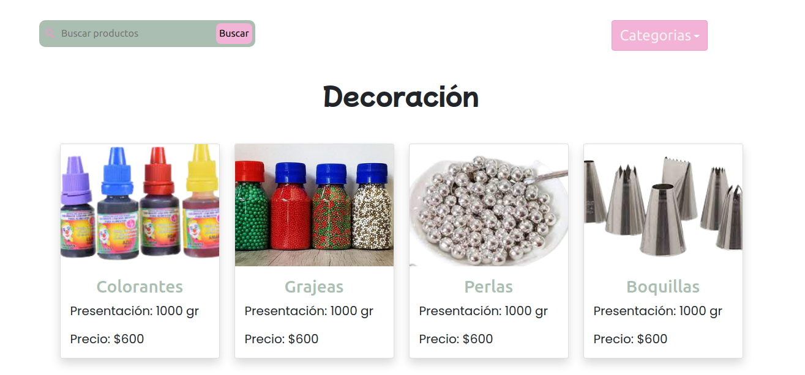
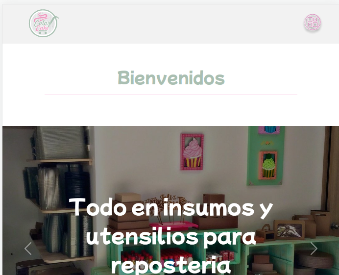

# Proyecto carrito de compras para un cliente real

<h1>Color cake</h1>

<em> Educamás -> <a href="https://educamas.com.co/">Programate</a> Cohorte IV REEDOM DEVELOPER. 💻  
</em>

¡Un cliente real! para contribuir con el fortalecimiento y la mejora económica de nuestro entorno cercano post-Covid19

<h2>📌 Contexto del proyecto</h2>

🏆 Trabajado por Daniela puerta castrillon

<h2>Contexto del proyecto</h2>

Este será tu primer reto profesional enfocado en un cliente real, tendrás que sacar tus habilidades de comunicación asertiva y tus habilidades de manejo de cliente.

Simultáneo a la práctica de estas habilidades blandas y ponerlas en un contexto real, evaluaremos el código para cumplir con las primeras tres competencias dedicadas al frontend de nuestro bootcamp en su nivel 3, también tendremos en cuenta la usabilidad e interactividad del usuario final.

Recuerda las recomendaciones que te hemos dado hasta este momento para recibir la competencia nivel 3.

⚙️ Requerimientos técnicos ⚙️

🍩 Realizar un planning y product backlog respetando las fechas de las entregas
🍩 Se requiere estudio previo del negocio del cliente
🍩 Se requiere Mockup
🍩 Se requiere Prototipo
🍩 El desarrollo debe ser con React
🍩 El desarrollo debe usar CSS para dar estilos, puedes hacer uso de alguna librería
🍩 El desarrollo debe contar con un carrito de compra (no es pasarela de pago)
🍩 El desarrollo debe tener la funcionalidad de al finalizar el pedido, el establecimiento debe recibirlo a través de WhatsApp (debe incluir los productos, la cantidad de productos, el total de cada producto dependiendo de las unidades pedidas y el total de todo el pedido, si ves algún dato más relevante puedes agregarlo)
🍩 El desarrollo debe estar en inglés al 100% menos para los strings que ve el usuario final pues estos deben estar en Español.
🍩 El desarrollo debe contar con filtros de categorías para los diversos productos
🍩 El desarrollo debe contar con documentación técnica (debe ser bien documentado para futuros mantenimientos o estabilidad)
🍩 El desarrollo debe respetar la carta gráfica del cliente o la que ustedes le propongan al cliente (en caso de no tenerla deben diseñar la carta gráfica con logo, paletas de colores)
​

🍩 El desarrollo debe ser RESPONSIVE con uso de la estrategia Mobile First
🍩 El desarrollo debe contar con las siguientes vistas:
Bienvenida a la tienda y descripción del negocio
Productos (acá se debe manejar el filtro de categorías)
Carrito de compras
Resúmen de las compras con botón para hacer el domicilio vía WhatsApp

<h2>🛠 Tech Stack</h2>

- 🌐 &nbsp; HTML5 | CSS3 | Bootstrap | reactjs |

